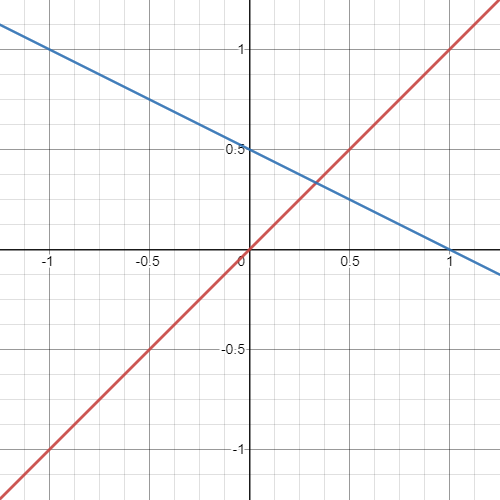

# mpv-scripts
Any mpv scripts I've created that I feel are worth sharing.

## dynamic-bcspline

A flexible filtering option that is well suited for scaling in linear color space. [Upscaling in linear light is generally recommended against](https://legacy.imagemagick.org/Usage/filter/nicolas/#upsampling_examples), however there are many instances in which one would want to do so.

By modifying the B-spline (B) and Cardinal (C) at different zoom levels through parameters exposed by mpv, sharpness can be retained in downscaling and slight upscaling. At larger upscaling increments the image becomes more blurred to counteract stairstepping and oversharpening; especially the more noticeable ringing artifacts from linear upscaling.

### Explanation

B and C have an inverse relationship where `C = (1 - B) / 2`.

    

You may notice that the lines intersect at `(1/3, 1/3)` which is the same as the Mitchell filter. This relationship is categorized as the `Keys Cubic Filter Family`.

    
    <figcaption>
        <a href = "https://legacy.imagemagick.org/Usage/filter/#cubics">
            https://legacy.imagemagick.org/Usage/filter/#cubics
        </a>
    </figcaption>

To scale B and C according to zoom level we need the ratio which is the scaled image divided by the original image, converted to log base 2. For instance a 720p image scaled to 1080p has a ratio of 3 and a log base 2 ratio of 0.585. A 1080p image scaled to 720p has a ratio of 0.667 and a log base 2 ratio of -0.585.

So the log base 2 ratio is a nice linearly scaling number with an origin of 0 whic can be plugged into our formula. Now we want to modify our formula to be a gradual curve between 0 and 1 in the positive direction.

    
     <figcaption>
        <a href = "https://en.wikipedia.org/wiki/Sigmoid_function">
            https://en.wikipedia.org/wiki/Sigmoid_function
        </a>
    </figcaption>

`x/1+|x|` is the easiest sigmoid function to work with as the intersection naturally lands at `(1/2, 1/3)`. Multiplying our value by 1.5 creates an intersection of `(1/3, 1/3)` once again.

    <iframe src="https://www.desmos.com/calculator/tizsx3x6vs?embed" width="500px" height="500px" frameborder=0></iframe>

This gives us B and C for any zoom value above and below 0. Values below 0 don't necessarily have to be used due to how correct-downscaling works but it's nice to have if more sharpening when downscaling is needed.
